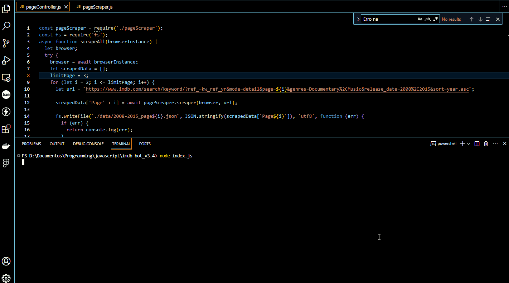

  <h1>Imdb Bot</h1>
  

> ## Descrição
>
> Este aplicativo foi desenvolvido durante um projeto pessoal, em que foi necessário obter dados de filmes no imdb.
> O mesmo usa o Puppeteer para acessar os filmes de alguma lista filtrada no imdb, extrair as informações e salvá-las em um arquivo json local.

> ## Tecnologias

- Node
- Puppeteer
- JSON

> ## Como usar

1. Faça o clone deste repositório: https://github.com/tiagofmuniz/imdb-bot.git
2. No arquivo pageController, na variável 'limitPage', defina a quantidade de páginas que o bot deve percorrer. Deve ser um number.
3. Na variável 'url' insira o link da lista, tomando o cuidado para substituir o número de página por '${i}'. Exemplo: 
let url = `https://www.imdb.com/search/keyword/?ref_=kw_ref_yr&mode=detail&page=*${i}\*&genres=Documentary%2CMusic&release_date=2008%2C2015&sort=year,asc`;
4. Na pasta raiz, execute o comando 'node index.js' para iniciar o servidor e rodar a aplicação.
**Observação:** Para ocultar o navegador chromium enquanto o bot roda, basta, no arquivo browser.ks definir a propriedade 'headless' como false. 
Também  é possível alterar o nome dos arquivos json salvos, bastando editar, no arquivo pageController.js o seguinte trecho: 'fs.writeFile(`./data/2008-2015_page${i}.json`...)' para fs.writeFile(`./data/novonomedosarquivos_page${i}.json`...)'

 ## Principais aprendizados

- Manipulação de DOM via chromium.
- Manipulação do DOM (Document Object Model) em JavaScript para atualizar dinamicamente o conteúdo da página.
- Web scraping.

